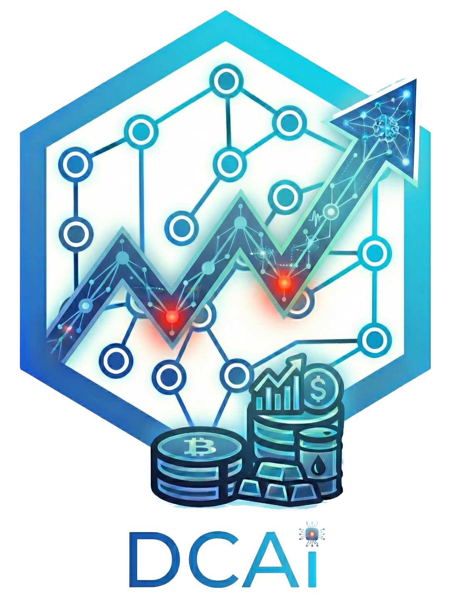
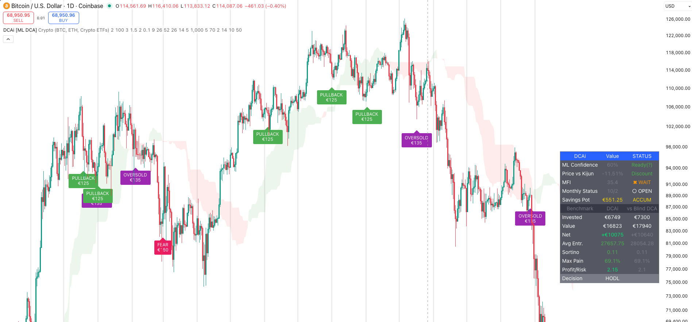
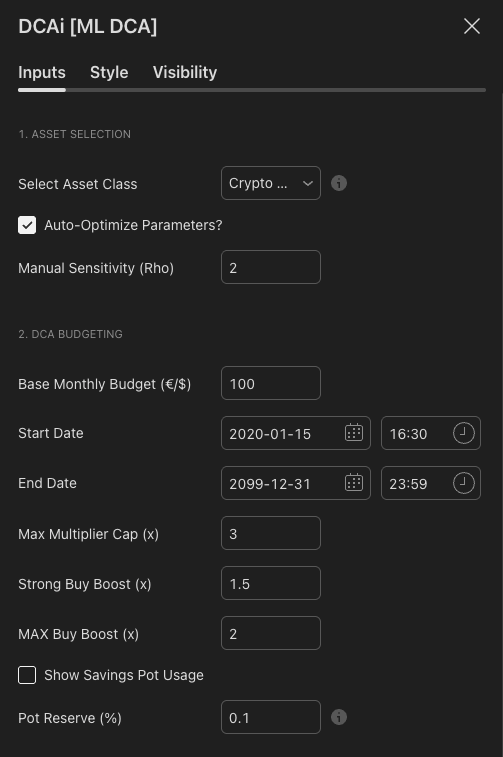

# DCAi: Machine Learning Based DCA Strategy

  

---

**Dadicated to all HODLers:**

> *We don’t panic sell, we DCA the dips so hard they file a class‑action restraining order.*

---
## Abstract
**DCAi** is a high-fidelity algorithmic trading framework designed to optimize the traditional Dollar-Cost Averaging (DCA) methodology. By integrating **K-Nearest Neighbors (KNN)** classification with **Lorentzian Distance** and adaptive budget allocation, the strategy aims to lower the average entry price while managing downside risk more effectively than "blind" passive investing.

---

---

## Table of Contents

1. [The Inefficiency of Static DCA](#1-the-inefficiency-of-static-dca)
   - [Problem 1: Wasted Capital During Sideways/Bull Markets](#problem-1-wasted-capital-during-sidewaysbull-markets)
   - [Problem 2: Uniform Position Sizing Ignores Volatility](#problem-2-uniform-position-sizing-ignores-volatility--price-deviations)
   - [Problem 3: Capital Exhaustion in Prolonged Bear Markets](#problem-3-capital-exhaustion-in-prolonged-bear-markets)

2. [Core Architecture](#2-core-architecture)
   - [2.1 Machine Learning Engine (KNN)](#21-machine-learning-engine-knn)
     - [2.1.1 How It Works](#211-how-it-works)
     - [2.1.2 Technical Summary](#212-technical-summary)
   - [2.2 Adaptive Asset Sensitivity](#22-adaptive-asset-sensitivity)
     - [2.2.1 The Rho (ρ) Sensitivity Parameter](#221-the-rho-ρ-sensitivity-parameter)
     - [2.2.2 Adaptive Thresholds by Asset Class](#222-adaptive-thresholds-by-asset-class)
   - [2.3 Quick Reference](#23-quick-reference)

3. [Decision Engine Logic](#3-decision-engine-logic)

4. [Financial Engineering & Budgeting](#4-financial-engineering--budgeting)
   - [4.1 Smart Budgeting (The Savings Pot)](#41-smart-budgeting-the-savings-pot)
   - [4.2 Dynamic Position Sizing](#42-dynamic-position-sizing)

5. [Comparative Analysis: Pros & Cons](#5-comparative-analysis-pros--cons)
   - [5.1 Advantages of DCAi](#51-advantages-of-dcai)
   - [5.2 Limitations & Risks](#52-limitations--risks)

6. [Future Research & Roadmap](#6-future-research--roadmap)

7. [Configuration & Parameters](#7-configuration--parameters)
   - [7.1 Asset Selection & Auto-Optimization](#71-asset-selection--auto-optimization)
   - [7.2 Machine Learning Settings (KNN)](#72-machine-learning-settings-knn)
   - [7.3 Financial Parameters (Budgeting)](#73-financial-parameters-budgeting)
   - [7.4 Technical Confirmation (Filtering)](#74-technical-confirmation-filtering)
   - [7.5 Recommended Configurations](#75-recommended-configurations)
   - [7.6 Parameter Tuning & Optimization Guide](#76-parameter-tuning--optimization-guide)
   - [7.7 Parameter Interactions & Dependencies](#77-parameter-interactions--dependencies)
   - [7.8 Community Settings & Contributions](#78-community-settings--contributions)

8. [Frequently Asked Questions (FAQ)](#8-frequently-asked-questions-faq)

9. [References & Academic Foundation](#9-references--academic-foundation)

10. [Disclaimer & Risk Warning](#10-disclaimer--risk-warning)

---

## 1. The Inefficiency of Static DCA
Traditional Dollar-Cost Averaging (DCA) is a passive strategy that executes purchases at fixed intervals regardless of market valuations. While psychologically effective for retail investors, it suffers from several mathematical inefficiencies:

### Problem 1: Wasted Capital During Sideways/Bull Markets
**Issue**: Static DCA allocates the full monthly budget every period, regardless of market regime. During bull markets or sideways consolidation, this means deploying capital at progressively higher prices—missing the opportunity to accumulate more units during deep discounts (Black Swan crashes, capitulation events).

**Why This Matters**: If Bitcoin crashes 70% but your monthly allocation was already spent 30% higher, you've missed the chance to double down during extreme fear.

**DCAi Solution** (see **Section 4.1: Savings Pot**): Instead of forced monthly deployment, DCAi accumulates unused capital into a **Savings Pot**. When the ML engine detects a high-conviction reversal signal (Section 3: Decision Engine Logic), it deploys this reserve for aggressive entries. This transforms missed opportunities into compounding advantages.

---

### Problem 2: Uniform Position Sizing Ignores Volatility & Price Deviations
**Issue**: Static DCA invests the same dollar amount every month, regardless of whether the asset is trading near all-time lows or all-time highs. This creates an *inverse* relationship between expected return and capital deployment—you buy more when valuations are worst... except in terms of Capital Exposure. While Static DCA buys more units mathematically, it fails to increase Fiat Capital allocation during deep discounts, treating a -5% dip and a -50% crash with the same financial urgency.

**Why This Matters**: Asset volatility varies dramatically. A 20% drawdown on the S&P 500 is a 10-year event; a 20% daily swing on a micro-cap altcoin is Tuesday. Static DCA treats both identically.

**DCAi Solution** (see **Section 4.2: Dynamic Position Sizing** and **Section 2.2: Adaptive Asset Sensitivity**): DCAi uses **Inverse-Price Weighting** with an exponential $\rho$ (Rho) parameter. As price falls relative to the historical average, buy sizes increase *exponentially*. The $\rho$ value is automatically adjusted per asset class to match volatility signatures (Crypto: 1.7, Stocks: 2.0, Indices: 2.5). This ensures you deploy aggressively during deep dips and conservatively during peaks.

---

### Problem 3: Capital Exhaustion in Prolonged Bear Markets
**Issue**: Static DCA commits all capital upfront on a predictable schedule. In a 3+ year bear market, this means your capital is fully deployed by Year 2, leaving nothing for the "generational bottom" that often occurs at the end of a cycle (e.g., crypto bear markets bottoming years after the bull peak).

**Why This Matters**: Buy-and-hold investors who bought Bitcoin at $60K in 2021 had no reserves left to buy at $16K in 2022—despite both being part of the same DCA plan. The timing mismatch is devastating.

**DCAi Solution** (see **Section 4.1: Savings Pot** and **Section 3: Decision Engine Logic**): The Savings Pot naturally preserves capital during non-signal periods. Additionally, the ML engine's three-tier decision framework (Tier 1 Pullback < Tier 2 Oversold < Tier 3 Fear) uses probabilistic gating to *reduce* entries during low-conviction periods and *concentrate* capital during high-conviction reversals. Combined with (see **Section 7.3: Pot Reserve %**), you can reserve a percentage of the pot for extreme-case deployments.

---

## 2. Core Architecture

### 2.1 Machine Learning Engine (KNN)

#### 2.1.1 How It Works

DCAi searches historical price data to find past situations that match current market conditions. When the market looks oversold today, the algorithm scans back through thousands of historical bars to find the **K** most similar moments. It then checks what happened next—did price rally or keep falling?

The **K parameter** controls how many historical examples to examine. K=5 means "find the 5 most similar past situations." If 4 out of 5 led to price increases, that's 80% confidence. Higher K values require more historical agreement before triggering a buy, making the system more conservative.

**The Three Market Conditions (Features):**

DCAi compares three metrics to identify similar market states:

1. **Money Flow Index (MFI)** — Measures buying vs. selling pressure on a 0-100 scale. Values below 20 indicate panic selling, above 80 suggests euphoric buying. DCAi targets oversold zones between 0-55 depending on the asset.

2. **Rate of Change (ROC)** — Tracks price velocity. Negative values mean falling prices; the more negative, the steeper the decline. This filters for actual dips rather than sideways drift.

3. **Average True Range (ATR)** — Quantifies volatility magnitude. High ATR during selloffs signals market distress, which often precedes reversals.

**Lorentzian Distance:**

Standard distance metrics (Euclidean) treat a 50% crash as fundamentally different from a 40% crash. But in pattern recognition, both represent "severe capitulation" and should be grouped together. Lorentzian Distance uses logarithmic scaling to match patterns by shape and direction rather than absolute magnitude. A crash is a crash—the exact percentage matters less than the overall structure.

#### 2.1.2 Technical Summary

* **Model**: K-Nearest Neighbors (KNN) non-parametric classifier
* **Features**: MFI, ROC, ATR normalized to percentile ranks
* **Distance Metric**: Lorentzian Distance (log-damped)
* **Prediction Window**: 4-bar forward-looking
* **Confidence**: ML probability (0-100%) gates entries and scales position size
* **Thresholds**: 70% minimum for oversold entries, 50% for pullback entries

### 2.2 Adaptive Asset Sensitivity

#### 2.2.1 The Rho (ρ) Sensitivity Parameter

Rho determines how much your position size increases as price falls below its historical average. Static DCA deploys the same dollar amount every period. DCAi scales exponentially—the deeper the dip, the larger the buy.

With a €100 monthly budget on Bitcoin:

| Price Drop | Rho = 1.7 (Crypto Default) | Rho = 2.5 (Index Default) |
|:---|:---|:---|
| 0% (at average) | €100 | €100 |
| -10% | €120 | €130 |
| -25% | €170 | €220 |
| -40% | €280 | €440 |
| -60% | €600 | €1,160 |

Lower Rho (1.5-1.7) suits volatile assets where -40% drawdowns happen frequently. Higher Rho (2.0-2.5) suits stable assets where deep dips are rare and should be exploited aggressively.

Crypto can stay oversold for months—a moderate Rho prevents premature capital exhaustion. Index crashes (2008, 2020) are generational events that warrant maximum deployment, hence higher Rho.

#### 2.2.2 Adaptive Thresholds by Asset Class

MFI thresholds vary by asset because "oversold" is relative to market structure:

| Asset Class | MFI Target Min | MFI Target Max | Sensitivity ($\rho$) | Notes |
| :--- | :--- | :--- | :--- | :--- |
| **Crypto** | 0 | 35 | 1.7 | MFI<20 can persist for weeks in bear markets |
| **Stocks** | 0 | 55 | 2.0 | Faster mean reversion, wider acceptable range |
| **Indices** | 30 | 48 | 2.5 | MFI<30 is already extreme panic |
| **Commodities** | 35 | 50 | 2.5 | Strong mean reversion tendencies |

When you select an asset class, DCAi calibrates both the oversold threshold and position scaling to match that market's typical behavior.

---

#### 2.3 Quick Reference

| Parameter | Function | Default |
|:---|:---|:---|
| **K-Neighbors** | Number of historical situations to compare | 5 |
| **Lorentzian Distance** | Pattern matching via log-scaled shape recognition | Always on |
| **MFI** | Buying/selling pressure (0-100 scale) | <35 oversold |
| **ROC** | Price velocity (negative = falling) | Negative triggers |
| **ATR** | Volatility magnitude | High = opportunity |
| **Rho (ρ)** | Position size scaling exponential | 1.7-2.5 by asset |
| **ML Confidence** | Pattern match probability (%) | 70% min |

DCAi compares current market conditions (MFI, ROC, ATR) against historical data to find similar patterns, verifies those patterns led to price increases, then scales position size based on dip severity and pattern confidence.

---

## 3. Decision Engine Logic
The strategy prioritizes trades into three distinct tiers based on signal conviction and liquidity availability:

1.  **Tier 1: PULLBACK BUY (Trend Following)**
    * Occurs in healthy uptrends when price trades in the "discount zone" below the Ichimoku Kijun-sen, above Leading Span B, and the cloud is green.
2.  **Tier 2: OVERSOLD BUY (Standard Dip)**
    * Activated in oversold conditions (MFI < 35), with dynamic relaxation when CVD divergence is bullish, and ML confirmation.
    * Uses a **Strong Boost** multiplier (default 1.5x).
3.  **Tier 3: FEAR BUY (Extreme Panic)**
    * Activated when MFI falls below the "Panic" threshold (default 20), with dynamic relaxation when CVD divergence is bullish.
    * Uses a **Max Multiplier** and aggressive pot allocation.

---

## 4. Financial Engineering & Budgeting

### 4.1 Smart Budgeting (The Savings Pot)
If no buy signal is triggered within a calendar month, the monthly budget is automatically rolled over into a **Savings Pot**. This "carryover" mechanism allows for massive capital deployment during black swan events or extreme market lows.

### 4.2 Dynamic Position Sizing
The investment amount is calculated using an **Inverse-Price Weighting** formula:

* **Exponential Scaling**: As price falls relative to the historical average, the buy amount increases exponentially based on the **$\rho$** parameter.
* **Confidence Boost**: ML probability acts as a multiplier; higher confidence increases the multiplier and pot usage on a continuous scale (starting above 50% confidence).

---

## 5. Comparative Analysis: Pros & Cons

### 5.1 Advantages of DCAi
* **Dynamic Sensitivity**: Utilizes the $\rho$ parameter to exponentially increase buy size during extreme deviations.
* **ML-Driven Confirmation**: The KNN engine filters out "falling knives" by requiring historical pattern similarity.
* **Capital Preservation**: The **Savings Pot** ensures capital is preserved for high-probability reversal zones.

### 5.2 Limitations & Risks
* **Computational Overload**: KNN models in Pine Script are limited by the lookback window (max 3000 bars).
* **Overfitting Risk**: Risk that Lorentzian distance parameters may overfit to recent price action.
* **Execution Latency**: Relies on bar closes, which might result in slightly higher entries during fast V-shape recoveries.

---

## 6. Future Research & Roadmap
1.  **Sentiment Integration**: Incorporating on-chain data or Funding Rates as additional features.
2.  **Multi-Timeframe Validation**: Correlating 4-bar predictions across Daily and Weekly intervals.
3.  **Recursive Learning**: Implementing a self-correcting mechanism for the $\rho$ parameter based on realized drawdown.

---
## 7. Configuration & Parameters

DCAi offers a highly granular settings menu to align the algorithm with your specific risk profile and asset class.

### 7.1 Asset Selection & Auto-Optimization
* **Asset Class**: Choose between `Crypto`, `Stocks`, `Indices`, or `Commodities`. This selection automatically adjusts:
    * **MFI Thresholds**: Tailored to the typical volatility of each sector.
    * **Adaptive Sensitivity ($\rho$)**: Controls how aggressively the position size increases during dips.
* **Auto-Optimize Parameters**: When enabled, the script ignores manual overrides and uses pre-calculated optimal values for the selected asset.
* **Manual Sensitivity ($\rho$)**: Overrides auto-optimization when auto is disabled.

### 7.2 Machine Learning Settings (KNN)
* **Lookback Window**: Number of historical bars (up to 2800) the ML model uses to find similar patterns.
* **K-Neighbors**: The number of "nearest neighbors" compared (default is 5).
* **Probability Threshold**: The minimum ML confidence required to trigger an entry signal (defaults to 70% for strong signals and 50% for pullback entries).
* **ML Confidence Sensitivity**: Controls how strongly the distance-based confidence multiplier scales position sizing.
* **ROC Length (Feature)**: Length used for the ROC feature in the KNN input set.

### 7.3 Financial Parameters (Budgeting)
* **Monthly Budget**: Your total investable capital per month.
* **Start Date / End Date**: Limits signals and budgeting to a defined trading window.
* **Max Multiplier Cap**: Limits the maximum investment size for a single signal to prevent over-exposure.
* **Strong Buy Boost**: Multiplier applied to oversold signals.
* **Max Buy Boost**: Multiplier applied to fear signals.
* **Pot Reserve (%)**: Portion of the savings pot held back for extreme dips.
* **Show Savings Pot Usage**: Displays pot usage labels on the chart when enabled.

### 7.4 Technical Confirmation (Filtering)
* **Ichimoku Display Options**: Toggles for Tenkan/Kijun lines, Chikou span, and Kumo fill.
* **Cooldown Period**: Number of bars to wait between strong signals to avoid signal clustering.

---

### 7.5 Recommended Configurations

Below are three pre-built profiles aligned with different risk tolerances and market conditions (see **Section 2.1** ML settings and **Section 3** decision tiers for context):

#### **Profile A: CONSERVATIVE (Low Signal Frequency, Capital Preservation)**
*Best for: Risk-averse investors, volatile assets (micro-caps), bear markets*

| Parameter | Value | Rationale |
|:---|:---|:---|
| **Monthly Budget** | €100 | Lower monthly burn; pot can accumulate over 6+ months for large entries |
| **Auto-Optimize** | ✅ Enabled | Use asset-class defaults (Section 2.2) |
| **Lookback Window** | 1500 | Shorter window = less noise, focuses on recent patterns |
| **K-Neighbors** | 7-8 | Higher K = fewer false signals, more conservative voting |
| **Probability Threshold** | 75% | Strict entry gate (only high-conviction ML signals) |
| **ML Confidence Sensitivity** | 1.5 | Muted confidence scaling (avoid over-sizing on marginal signals) |
| **Pot Reserve %** | 25% | Keep 25% for Black Swan events |
| **Strong Buy Boost** | 1.3x | Light multiplier (Tier 2) |
| **Max Buy Boost** | 1.8x | Moderate multiplier (Tier 3) |
| **Cooldown Period** | 15 bars | Longer wait between signals prevents over-trading |

**Expected Behavior**: 1-3 signals/month, deeper drawdown reserve, higher avg entry quality

---

#### **Profile B: BALANCED (Default – Medium Risk/Reward)**
*Best for: Long-term investors, established assets (BTC/ETH, Index funds), 2-8 year horizons*

| Parameter | Value | Rationale |
|:---|:---|:---|
| **Monthly Budget** | €250 | Standard DCA amount; pot grows steadily |
| **Auto-Optimize** | ✅ Enabled | Adaptive to asset class volatility (Section 2.2) |
| **Lookback Window** | 2000 | Medium window balances recent trends + historical patterns |
| **K-Neighbors** | 5 | Default; good signal-noise tradeoff |
| **Probability Threshold** | 70% | Standard entry gate (Section 2.1) |
| **ML Confidence Sensitivity** | 2.0 | Moderate scaling (Section 4.2 continuous scaling) |
| **Pot Reserve %** | 15% | 15% reserve balances opportunity + safety |
| **Strong Buy Boost** | 1.5x | Standard multiplier (Tier 2, per Section 3) |
| **Max Buy Boost** | 2.0x | Default fear multiplier (Tier 3, per Section 3) |
| **Cooldown Period** | 10 bars | Standard multi-entry frequency |

**Expected Behavior**: 3-6 signals/month, reasonable pot accumulation, balanced entries across tiers

---

#### **Profile C: AGGRESSIVE (High Frequency, Pot-Driven)**
*Best for: Active investors, stable assets (large-cap stocks, top-tier crypto), bull/accumulation phases*

| Parameter | Value | Rationale |
|:---|:---|:---|
| **Monthly Budget** | €500+ | Massive monthly burn accelerates pot growth (Section 4.1) |
| **Auto-Optimize** | ✅ Enabled | Essential for volatile large positions |
| **Lookback Window** | 2800 | Maximum window; captures all historical regimes |
| **K-Neighbors** | 3-4 | Lower K = reactive signals, capitalizes on fast reversals |
| **Probability Threshold** | 60% | Relaxed gate; accept marginal signals (Tier 1 pullbacks more common) |
| **ML Confidence Sensitivity** | 2.5 | Aggressive scaling; high conviction → double position size |
| **Pot Reserve %** | 5% | Minimal reserve; deploy nearly all pot capital |
| **Strong Buy Boost** | 1.8x | Elevated oversold aggressiveness (Tier 2) |
| **Max Buy Boost** | 2.5x | Maximum fear response (Tier 3) |
| **Cooldown Period** | 5 bars | Allow rapid re-entry via decision tiers (Tier 1 pullback + Tier 3 fear same month) |

**Expected Behavior**: 8-15+ signals/month, rapid pot depletion/replenishment cycles, early entries into dips

---

### 7.6 Parameter Tuning & Optimization Guide

Fine-tuning DCAi for your specific asset and market regime requires systematic testing. Use this guide to iterate from a base profile:

#### **Step 1: Establish Your Baseline (Week 1)**
1. Start with **Profile B (Balanced)** for your asset class
2. Run the indicator live or backtest for 1-2 weeks (`Start Date` → `End Date` in Section 7.3)
3. Record: number of signals, average entry price, portfolio growth, drawdown

**Metric to Track**: *Signal Frequency* = signals/month (target: 3-8 for balanced)

---

#### **Step 2: Diagnose Over/Under-Trading (Week 2-3)**

| If You See... | Root Cause | Adjustment |
|:---|:---|:---|
| **Too Few Signals** (<1/month) | ML too strict, Lookback outdated, Or asset in strong trend with no dips | Decrease `Probability Threshold` by 5% OR increase `K-Neighbors` (paradoxically makes voting easier) OR shorter `Lookback Window` |
| **Too Many Signals** (>15/month) | ML too loose, or extreme volatility | Increase `Probability Threshold` by 5-10% OR lower `K-Neighbors` (stricter voting) |
| **Signals Cluster (3+ same day)** | `Cooldown Period` active across all tiers; Tier 1 blocks Tier 2/3 | Decrease `Cooldown Period` to 5-7 bars OR increase `Probability Threshold` to reduce Tier 1 frequency |
| **Pot Never Accumulates** | Too many monthly signals, money spent without pause | Increase `Probability Threshold` OR longer `Cooldown Period` |
| **Pot Accumulates But Never Deployed** | No high-conviction signals in your timeframe; conservative ML | Decrease `Probability Threshold` by 10% OR increase `ML Confidence Sensitivity` to scale smaller signals larger |

**Action**: Adjust ONE parameter per week and re-test 2+ weeks of data before next change.

---

#### **Step 3: Risk Profile Alignment (Week 4)**

**If you want MORE capital at risk during dips:**
- Increase `Monthly Budget` (more monthly salary → bigger entries)
- Increase `Strong Buy Boost` and `Max Buy Boost` (Section 3 tiers 2-3)
- Decrease `Pot Reserve %` (deploy more reserve capital)
- Decrease `ML Confidence Sensitivity` (even low-conviction signals get sized larger)

**If you want LESS capital at risk (capital preservation):**
- Decrease `Monthly Budget`
- Decrease `Strong Buy Boost` and `Max Buy Boost`
- Increase `Pot Reserve %` (10-30%)
- Increase `ML Confidence Sensitivity` (only confident signals get sized larger)
- Increase `Probability Threshold` (gate more entries)

---

#### **Step 4: Asset-Specific Tuning (Ongoing)**

**Crypto (BTC/ETH):** Auto Rho = 1.7 (Section 2.2)
- Crypto stays oversold for weeks; increase `Probability Threshold` to 75% to filter noise
- Larger daily swings justify higher `Monthly Budget` (€250+)
- Use Profile C settings or tune conservatively within Profile B

**Stocks (Tech, Blue-Chip):** Auto Rho = 2.0
- Stocks recover faster; lower `Cooldown Period` (5-8 bars) enables faster re-entry
- More efficient markets = tighter Lookback Window (1500 bars preferred)
- Profile B defaults work well; lower `K-Neighbors` to 3-4 for responsiveness

**Indices (S&P500, World ETFs):** Auto Rho = 2.5
- Broad indices are smoother; shorter `Lookback Window` (1000-1500) reduces lag
- Lower signal frequency natural; `Probability Threshold` 65-70%
- Profile A or low-end Profile B recommended

**Commodities (Gold, Metals):** Auto Rho = 2.5
- Cyclical and mean-reverting; increase `Lookback Window` to 2500+ to capture longer cycles
- Wider trading ranges = higher `Monthly Budget` justified
- Profile B/C hybrid: moderate budget ($300-700) + high Rho sensitivity

---

#### **Step 5: Backtesting & Live Validation (Weeks 5-12)**

1. **Backtest** (TradingView Pine Editor): Set `Start Date` 6+ months ago, run indicator
   - Compare DCAi portfolio (avg entry, ROI) vs. monthly passive DCA benchmark
   - DCAi should have **lower average entry price** and **similar or higher returns** (Section 1 advantages)

2. **Live Paper Trading** (1-2 weeks): Run on live chart without capital
   - Verify signals align with visual support/resistance
   - Check Ichimoku clouds (Tier 1 Pullback validation, Section 3)
   - Confirm ML confidence % is rising into dips (Section 2.1)

3. **Full-Size Live** (after 2+ weeks confidence): Deploy real capital
   - Start with smallest `Monthly Budget` tier (€50-100)
   - Scale up only if metrics align (lower avg entry, good entry quality)

---

#### **Red Flags: When to Reset Settings**

- **Average entry price is HIGHER than blind DCA**: ML settings too loose, increase `Probability Threshold` by 10%+
- **Portfolio never catches dips (<2 Tier 2/3 entries/year in volatile market)**: Decrease `Probability Threshold`, increase `K-Neighbors`, or double `Monthly Budget`
- **Drawdown exceeds 50% through no fault of market**: `Max Buy Boost` too aggressive; reduce to 1.5-2.0x, or increase `Pot Reserve %`
- **Pot grows to 10x+ monthly budget and never deploys**: Increase `Probability Threshold` is backwards; actually *decrease* it to trigger more deployments

---

### 7.7 Parameter Interactions & Dependencies

These parameters work together. Changing one affects optimal values of others:

| Change | Downstream Effects | Compensatory Adjustment |
|:---|:---|:---|
| Decrease `Probability Threshold` | More signals, faster pot depletion | Increase `Cooldown Period` OR decrease multipliers |
| Increase `Monthly Budget` | Pot grows faster, but also more monthly deployment | Increase `Probability Threshold` to offset, else over-trading |
| Decrease `Lookback Window` | ML more reactive to recent patterns | May increase false signals; increase `K-Neighbors` |
| Increase `K-Neighbors` | Fewer signals (higher voting threshold) | Decrease `Probability Threshold` to maintain signal frequency |
| Increase `ML Confidence Sensitivity` | Higher confidence = larger position size | Watch for over-concentrated entries; cap with `Max Multiplier Cap` |
| Decrease `Cooldown Period` | Allow multiple signals per period | Ensure pot sufficient; increase `Pot Reserve %` for safety |

---

### 7.8 Community Settings & Contributions

**We want to hear from you!** If you've optimized DCAi for your specific use case and achieved strong results, please share your configuration with the community in the **[GitHub Discussions](https://github.com/cerebrux/DCAi/discussions)** section.

#### **What to Share:**
When posting your settings, please include the following context to help others evaluate whether your configuration matches their needs:

- **Asset & Ticker**: What are you trading? (e.g., BTC/USDT, SPY, Gold futures)
- **Timeframe**: Daily (D), Weekly (W), or other?
- **Market Regime**: Bull market, bear market, accumulation phase, or full cycle test?
- **Profile Base**: Which recommended profile (A/B/C) did you start from?
- **Modified Parameters**: List the key settings you changed from the base profile
- **Performance Metrics** (optional but valuable):
  - Average entry price vs. blind DCA benchmark
  - Signal frequency (signals/month)
  - Pot accumulation behavior
  - Drawdown management
  - Time period tested (backtested or live)

#### **Why Share Your Settings?**
- **Real-world validation**: Community testing covers market conditions no single backtest can simulate
- **Asset-specific optimization**: Users trading similar assets benefit from your discoveries
- **Edge cases**: Unusual assets (high-vol small-caps, seasonal commodities) need tuning beyond default profiles
- **Collective refinement**: Best configurations emerge through collaboration, not isolation

#### **Contributing Your Settings:**
1. Navigate to **[GitHub Discussions → Share Your Settings](https://github.com/cerebrux/DCAi/discussions)**
2. Create a new discussion post with a descriptive title (e.g., "BTC Daily - Conservative Bear Market Profile")
3. Use the template format above to provide context
4. Optional: Include screenshots of your backtest results or key signals

**Note**: All shared configurations are community-contributed and not officially endorsed. Always backtest and paper trade any community settings before deploying real capital (see **Section 7.6, Step 5** for validation methodology).

---

## 8. Frequently Asked Questions (FAQ)

### Q1: How does the "Savings Pot" work in practice?
**A:** Unused monthly budget accumulates into the Savings Pot. If your monthly budget is €100 but the market is rallying with no buy signals, that €100 rolls over. During the next qualifying dip, DCAi can deploy both the current month's budget plus accumulated reserves, significantly lowering your average entry.

### Q2: Why use Lorentzian Distance instead of standard Euclidean Distance?
**A:** Euclidean distance amplifies outliers. A 50% crash and a 40% crash would be treated as fundamentally different patterns despite both representing severe capitulation. Lorentzian Distance uses logarithmic scaling to match patterns by structural shape rather than absolute magnitude, making it more robust for financial data with frequent spikes and crashes.

### Q3: Is DCAi suitable for Day Trading or Scalping?
**A:** No. DCAi is an investment-grade framework designed for **Swing Traders** and **Long-term Investors**. It performs best on Daily (D) or Weekly (W) timeframes. Using it on low timeframes (e.g., 1-minute or 5-minute) may result in excessive signals caused by market noise, leading to premature capital exhaustion.

### Q4: What exactly does the Sensitivity ($\rho$) parameter control?
**A:** The $\rho$ (Rho) parameter determines how aggressively the algorithm scales its position size relative to price drops. 
* **High $\rho$**: The buy amount increases exponentially as the price falls further below the mean.
* **Low $\rho$**: The allocation is more linear, behaving closer to traditional, flat-rate DCA.

### Q5: How does the "Asset Selection" impact the strategy?
**A:** Different assets have different "volatility signatures." For example, the Money Flow Index (MFI) on Bitcoin can stay oversold much longer than on the S&P 500. By selecting the correct **Asset Class**, the algorithm automatically re-calibrates its "Panic" and "Oversold" thresholds to match that specific market's behavior.

### Q6: Can I use DCAi for an automated Trading Bot or Web Service?
**A:** Yes, you are permitted to do so under the **AGPL-3.0 License**. However, the "Network Interaction" clause of the AGPL states that if you run a modified version of this script on a server (SaaS), you **must** make your modified source code available to the users of that service.

### Q7: Does the ML engine "repaint"?
**A:** No. The KNN classification is calculated on bar closes. Once a bar is confirmed and the signal is printed, the historical pattern matching for that specific point in time remains fixed. This ensures that backtesting results are representative of real-world performance.

---
## 9. References & Academic Foundation

This project integrates concepts from behavioral finance, machine learning, and quantitative risk management. Below is the list of foundational research papers and literature used to design the **QIA (Quant Investment Assistant)** logic.

## 1. Dollar-Cost Averaging (DCA) & Behavioral Finance
*   **Statman, M. (1995).** "A Behavioral Framework for Dollar-Cost Averaging." *The Journal of Portfolio Management*, 22(1), 70-78.
    *   *Explores why investors prefer DCA for psychological reasons (regret minimization) despite mathematical sub-optimality in bull markets.*
*   **Thorley, S. R. (1994).** "The Fallacy of Dollar-Cost Averaging." *Financial Practice and Education*, 4(2), 17-26.
    *   *Analyzes the mathematical properties of DCA compared to Lump Sum investing.*
*   **Leggio, K. B., & Lien, D. (2001).** "Does Dollar Cost Averaging Make Sense?" *Financial Services Review*, 10(1), 73-86.
    *   *A critical assessment of DCA performance using risk-adjusted return metrics (Sortino/Sharpe).*

## 2. Machine Learning & K-Nearest Neighbors
*   **Fix, E., & Hodges, J. L. (1951).** "Discriminatory Analysis: Nonparametric Discrimination: Consistency Properties." *USAF School of Aviation Medicine*, Randolph Field, Texas.
    *   *The seminal paper that introduced the K-Nearest Neighbors (KNN) algorithm.*
*   **De Prado, M. L. (2018).** *Advances in Financial Machine Learning.* Wiley.
    *   *The industry standard reference for applying ML techniques to financial time-series data.*
*   **Jansen, S. (2020).** *Machine Learning for Algorithmic Trading.* Packt Publishing.
    *   *Practical implementation of ML strategies in trading systems.*

## 3. Technical Analysis & Volatility Dynamics
*   **Wilder, R. S. (1978).** *New Concepts in Technical Trading Systems.* Trend Research.
    *   *The origin of the **Average True Range (ATR)**, which represents the volatility component (Feature f3) in the QIA machine learning model.*
*   **Quong, G., & Soudack, A. (1989).** "Volume-Weighted RSI: Money Flow Index." *Technical Analysis of Stocks & Commodities*, 7(3).
    *   *The original publication introducing the **Money Flow Index (MFI)**, used here as the primary momentum/volume oscillator for identifying capitulation.*
*   **Murphy, J. J. (1999).** *Technical Analysis of the Financial Markets.* Penguin York Institute of Finance.
    *   *The standard textbook for technical analysis, providing the definitive definition of **Rate of Change (ROC)** as the purest measure of price velocity and momentum used in Feature f2.*
*   **Harris, L. (2003).** *Trading and Exchanges: Market Microstructure for Practitioners.* Oxford University Press.
    *   *Provides the theoretical framework for **Cumulative Volume Delta (CVD)** by analyzing the bid-ask spread and aggressive order flow (Delta) to identify buyer/seller absorption.*
*   **Hosoda, G. (Ichimoku Sanjin). (1969).** *Ichimoku Kinko Hyo (一目均衡表).* Economic Statistics Research Institute.
    *   *The original source for the **Ichimoku Cloud** theory, used in this system to define the equilibrium zones for trend validation.*

## 4. Risk-Adjusted Performance Metrics
*   **Sortino, F. A., & Price, L. N. (1994).** "Performance Measurement in a Downside Risk Framework." *The Journal of Investing*, 3(3), 59-65.
    *   *Introduction of the Sortino Ratio, distinguishing between harmful volatility (downside) and general volatility.*
*   **Young, T. W. (1991).** "Calmar Ratio: A Smoother Tool." *Futures Magazine*, 20(10), 40.
    *   *Introduction of the Calmar Ratio (CAGR / Max Drawdown) for evaluating hedge fund performance.*

## 5. Quantitative Strategy Optimization
*   **Pardo, R. (2008).** *The Evaluation and Optimization of Trading Strategies.* Wiley Trading.
    *   *Methodologies for backtesting, walk-forward analysis, and avoiding overfitting.*
*   **Narang, R. K. (2013).** *Inside the Black Box: A Simple Guide to Quantitative and High-Frequency Trading.* Wiley.
    *   *Insights into the structure of professional quant systems and alpha generation.*
---

## 10. Disclaimer & Risk Warning

### 10.1 No Financial Advice
**THIS IS NOT FINANCIAL ADVICE.** This software and documentation are provided for **educational and research purposes only**. Nothing herein constitutes investment advice, a recommendation, or an endorsement of any security or investment strategy. The authors are not licensed financial advisors, investment advisors, or registered representatives. Do not rely on this software for investment decisions.

### 10.2 Assumption of Risk
**You use this software entirely at your own risk.** Trading and investing in ANY asset class (crypto, stocks, indices, commodities) involve substantial risk of loss, including the potential loss of your entire principal. No trading strategy, algorithm, or machine learning model—including DCAi—can guarantee profits or prevent losses. Market conditions are unpredictable and can change rapidly due to:
- Geopolitical events and news shocks
- Technical platform failures (TradingView, exchanges, brokers)
- Flash crashes, circuit breakers, and execution slippage
- Regulatory changes and sudden liquidity withdrawal
- Black Swan events and unforeseen systemic risks

### 10.3 No Warranties
Under the **AGPL-3.0 License**, this software is provided **"AS IS"** without any warranty whatsoever. The authors explicitly disclaim:
- Any express or implied warranty of merchantability
- Any warranty of fitness for a particular purpose
- Any warranty that the software will be error-free or uninterrupted
- Any warranty regarding accuracy, completeness, or usefulness of results
- Any warranty about the performance of the KNN algorithm or ML predictions

### 10.4 Limitation of Liability
**The authors shall not be liable for any direct, indirect, incidental, special, consequential, or punitive damages**, including but not limited to:
- Financial losses or costs incurred from using or relying on this software
- Lost profits, loss of investment capital, or opportunity costs
- Data loss or corruption
- Third-party claims or regulatory fines
- Any other damages arising out of or in connection with this software

This limitation applies regardless of whether damages were foreseeable or whether the authors were advised of the possibility of such damages.

### 10.5 Backtesting & Past Performance Limitations
- **Historical results do not guarantee future performance.** Backtesting uses historical data and cannot account for future market conditions, regime changes, or structural breaks.
- **Backtesting bias**: Model parameters may be overfit to past data. KNN models can have reduced predictive power in novel market conditions.
- **Execution reality**: Simulated results assume perfect order execution. Real-world trading incurs slippage, fees, commissions, and liquidity constraints.
- **No repainting disclaimer**: While the KNN model does not "repaint," TradingView's bar aggregation or time zone settings may cause signals to appear at different times than expected.

### 10.6 Technical & Platform-Specific Risks
- **Pine Script Limitations**: This is a Pine Script v6 indicator running on TradingView. It is dependent on:
  - TradingView's data feeds, which may contain gaps, errors, or delays
  - The stability and availability of the TradingView platform
  - Correct bar aggregation and time zone settings
- **Broker/Exchange Risks**: Execution of trades based on DCAi signals depends on your broker's systems, liquidity, and regulatory compliance. DCAi has no control over broker order execution.
- **Connectivity & Latency**: Internet outages, platform downtime, or network delays may prevent signal execution.

### 10.7 ML & Algorithm Limitations
- **KNN is non-parametric**: The algorithm relies on historical similarity. In truly novel market regimes, performance may degrade significantly.
- **Feature engineering limitations**: The three features (MFI, ROC, ATR) are normalized metrics. Extreme events (market halts, regulatory interventions) may break this model.
- **Lookback window constraint**: The model is limited to ~2,800 bars of history due to Pine Script computational constraints.
- **No guarantee of convergence**: The "4-bar forward prediction window" is arbitrary and may not capture the true reversal zone in all markets.

### 10.8 Asset Class Dependency
DCAi's behavior is highly asset-dependent. The pre-configured parameters (MFI thresholds, Rho sensitivity) may work well for the tested asset classes (Crypto, Stocks, Indices, Commodities) but:
- May not generalize to other assets (forex, futures, micro-caps)
- Require different tuning for different market conditions (bull vs. bear markets)
- May experience unexpected behavior on assets with low liquidity or unusual volatility profiles

### 10.9 User Responsibility
**You are solely and entirely responsible** for:
- Your own investment decisions and capital allocation
- Conducting thorough due diligence before using this software
- Understanding the risks and limitations outlined above
- Monitoring and validating signals before executing trades
- Complying with all applicable laws and regulations in your jurisdiction
- Consulting with a qualified, licensed financial advisor before deploying capital

### 10.10 No Endorsement
The inclusion of academic references in this README does not imply endorsement by those authors or institutions. Academic research is the foundation for concepts (DCA, KNN, Lorentzian Distance) but does not validate the specific implementation or results of DCAi.

---

**By using this software, you acknowledge that you have read, understood, and agree to assume all risks outlined above.**

---
## How to Use
1.  Copy the Pine Script code into the **TradingView** Pine Editor.
2.  Select your **Asset Class** in the settings to auto-configure volatility parameters.
3.  Select the **Start Date** of your DCA 
4.  Monitor the **Live Dashboard** for real-time ML confidence and budget status.

## License
This project is licensed under the **GNU Affero General Public License v3.0 (AGPL-3.0)**. 

### What does this mean?
- **Commercial Use**: You can use this for commercial purposes.
- **Modification**: You can modify the code.
- **Source Disclosure**: If you use this code in a web application or service (SaaS), you **must** release your source code under the same license.
- **Attribution**: You must keep the original copyright and license notice in all copies.